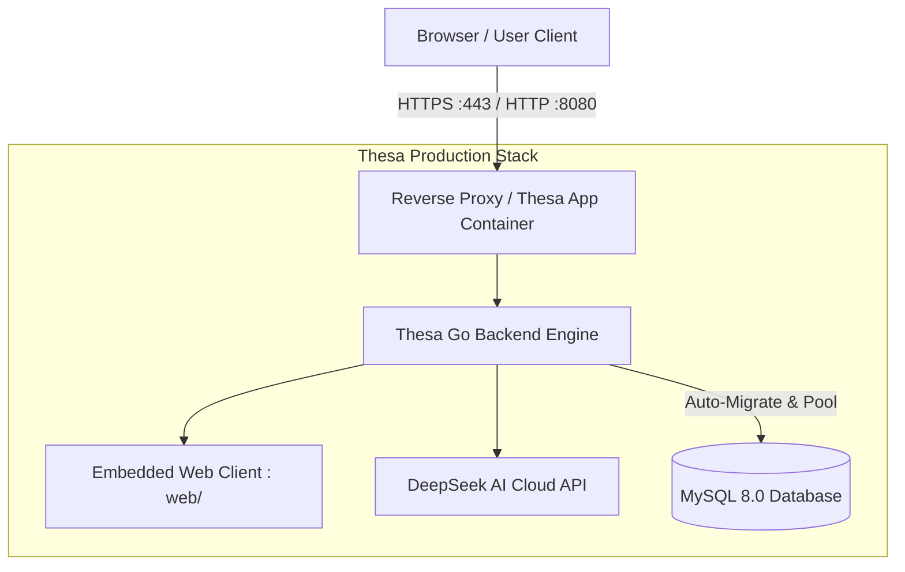

# 🚀 Thesa AI — Production Deployment Guide

Dokumen ini berisi panduan teknis langkah demi langkah untuk melakukan deploy Thesa AI (Backend Go + Database MySQL + Static Frontend) ke lingkungan produksi (VPS, Cloud Server, PaaS, atau Docker Stack).

---

## 🏗️ 1. Arsitektur Produksi



### Keunggulan Infra Saat Ini:
1. **Self-Bootstrapping Database**: Backend secara otomatis menjalankan auto-migrasi DDL (`schema.sql`) saat boot pertama kali.
2. **Resilience & Exponential Backoff**: Backend memiliki mekanisme retry 5x jika database butuh beberapa detik saat inisialisasi.
3. **Graceful Shutdown**: Menangani `SIGINT` dan `SIGTERM` dengan zero request dropping saat rolling update.
4. **Hardened Container**: Multi-stage build berbasis Alpine minimalis dan berjalan dengan non-root user `thesa`.

---

## ⚡ 2. Opsi Deployment

### Opsi A: VPS / Server Mandiri (Docker Compose) — *Paling Direkomendasikan*

Cocok untuk: DigitalOcean Droplet, AWS EC2, Hetzner, Alibaba Cloud, Linode, atau VM pribadi.

#### Langkah 1: Clone Repository di Server
```bash
git clone <URL_REPO_ANDA> thesa-ai
cd thesa-ai
```

#### Langkah 2: Siapkan Environment Variables
```bash
cp .env.example .env
nano .env
```
Isi variabel penting:
- `DEEPSEEK_API_KEY`: Masukkan API Key resmi DeepSeek Anda.
- `MYSQL_ROOT_PASSWORD`: Ganti dengan password database produksi yang kuat.
- `PORT`: 8080 (atau port yang diinginkan).

#### Langkah 3: Jalankan Stack
```bash
docker compose up -d --build
```

#### Langkah 4: Verifikasi Status
```bash
docker compose ps
docker compose logs -f thesa-app
```
Tes endpoint health:
```bash
curl http://localhost:8080/health
```
Output sukses:
```json
{
  "status": "ok",
  "app": "Thesa AI / Risethub BE",
  "version": "1.0.0",
  "database_connected": true,
  "deepseek_configured": true,
  "uptime_seconds": 12
}
```

---

### Opsi B: Koyeb Cloud Platform (Go Backend / Fullstack) — *Sangat Cepat & Mudah*

Koyeb adalah platform serverless cloud modern dengan lokasi server di Singapore (SIN) dan mendukung Docker secara native.

#### Langkah 1: Push Kode ke GitHub
Pastikan seluruh perubahan terbaru telah di-push ke repository GitHub Anda:
```bash
git push origin main
```

#### Langkah 2: Buat Service di Koyeb
1. Buka [Koyeb Dashboard](https://app.koyeb.com/) dan klik **"Create App"** atau **"Create Service"**.
2. Pilih sumber: **GitHub**.
3. Pilih repository `Thesa AI` Anda.
4. Pada bagian **Build & Deployment**:
   - Builder: Pilih **Dockerfile** (Koyeb akan membaca `Dockerfile` di root repository).
5. Pada bagian **Instance & Region**:
   - Region: Pilih **Singapore (sin)** untuk performa & latensi terbaik di Indonesia.
   - Plan: Pilih **Nano** / **Free Eco**.
6. Pada bagian **Port & Health Check**:
   - Port: `8080` (HTTP).
   - Health Check Path: `/health`.
7. Pada bagian **Environment Variables**, tambahkan:
   - `PORT`: `8080`
   - `AI_PRIMARY_PROVIDER`: `deepseek`
   - `DEEPSEEK_API_KEY`: *(Masukkan API Key DeepSeek Anda)*
   - `GEMINI_API_KEY`: *(Opsional: Masukkan API Key Google Gemini)*
   - `ADMIN_SECRET_KEY`: *(Buat kunci rahasia admin yang aman)*
   - `CORS_ALLOWED_ORIGINS`: `*` (atau domain Vercel Anda, misal: `https://thesa-ai.vercel.app`)
   - `DATABASE_URL`: *(Opsional: URL MySQL dari TiDB Cloud / Aiven / Railway)*
8. Klik **"Deploy"**. Dalam ~60 detik, backend Go Anda aktif dengan URL HTTPS publik otomatis (contoh: `https://thesa-ai-username.koyeb.app`).

---

### Opsi C: Vercel (Frontend Global CDN)

Untuk mendeploy antarmuka web statis ke Edge CDN global Vercel dengan performa super cepat:

#### Langkah 1: Impor Repository di Vercel
1. Buka [Vercel Dashboard](https://vercel.com/new).
2. Pilih repository GitHub Anda (`Thesa AI`).

#### Langkah 2: Konfigurasi Project Settings
- **Framework Preset**: `Other`
- **Root Directory**: `./` (biarkan default, `vercel.json` akan otomatis mendeteksi `web/`)
- **Build Command**: Kosongkan (tidak perlu build step karena static)
- **Output Directory**: `web` (sudah terdefinisi di `vercel.json`)

#### Langkah 3: Klik Deploy
Klik tombol **"Deploy"**. Vercel akan langsung menerbitkan web app Anda ke domain seperti `https://thesa-ai.vercel.app`.

> 💡 **Menghubungkan Frontend Vercel ke Backend Koyeb**:
> Jika Anda mendeploy frontend di Vercel dan backend di Koyeb, Anda cukup mengupdate `vercel.json` bagian `rewrites` untuk mem-proxy API ke Koyeb, atau langsung memanggil URL Koyeb karena backend Go telah mengaktifkan CORS otomatis.

---

### Opsi D: PaaS Lainnya (Render, Railway, Fly.io, Coolify)

Jika Anda menggunakan platform cloud lain:
- **Render**: Gunakan blueprint otomatis [`render.yaml`](file:///Volumes/Productive%20Space/Antigravity%20Project/Thesa%20AI/render.yaml) (`Render Blueprints -> New Blueprint Instance`).
- **Railway / Fly.io**: Cukup hubungkan repo Git, pilih `Dockerfile`, dan tentukan environment variables yang diperlukan.

---

### Opsi C: Nginx Reverse Proxy + SSL (Domain Publik)

Untuk menghubungkan domain kustom (contoh: `app.thesa.ai`) dengan sertifikat SSL gratis Let's Encrypt:

```nginx
server {
    server_name app.thesa.ai;

    location / {
        proxy_pass http://127.0.0.1:8080;
        proxy_http_version 1.1;
        proxy_set_header Upgrade $http_upgrade;
        proxy_set_header Connection 'upgrade';
        proxy_set_header Host $host;
        proxy_set_header X-Real-IP $remote_addr;
        proxy_set_header X-Forwarded-For $proxy_add_x_forwarded_for;
        proxy_set_header X-Forwarded-Proto $scheme;
        proxy_cache_bypass $http_upgrade;
        proxy_read_timeout 120s;
    }
}
```
Aktifkan SSL dengan Certbot:
```bash
sudo certbot --nginx -d app.thesa.ai
```

---

## 🛠️ 3. Operasional & Maintenance

### Backup Database
Untuk membuat backup database berkala:
```bash
docker exec thesa_ai_db mysqldump -u root -p<MYSQL_ROOT_PASSWORD> risethub > backup_$(date +%Y%m%d_%H%M%S).sql
```

### Restore Database
```bash
docker exec -i thesa_ai_db mysql -u root -p<MYSQL_ROOT_PASSWORD> risethub < backup_file.sql
```

### Update Versi Aplikasi (Rolling Restart)
```bash
git pull origin main
docker compose up -d --build --no-deps thesa-app
```
*(Server otomatis menangani `SIGTERM` secara graceful tanpa memutus koneksi user yang sedang aktif).*

---

## 🔍 4. Diagnostik & Monitoring Endpoint

### Sistem & Status:
- **`GET /health`**: Status koneksi database, kesiapan DeepSeek API, dan uptime sistem.
- **`GET /`**: Antarmuka web Thesa AI SPA.

### Autentikasi & Akun:
- **`POST /api/v1/auth/register`**: Registrasi akun mahasiswa/dosen (hashing SHA-256 + kalkulasi trust score).
- **`POST /api/v1/auth/login`**: Otentikasi dan penerbitan bearer token sesi 30 hari.
- **`GET /api/v1/auth/me`**: Verifikasi profil aktif via header `Authorization: Bearer <token>`.

### Modul Riset & AI:
- **`POST /api/literature/gap-analysis`**: Analisis novelty & kesenjangan riset berbasis DeepSeek + PubMed.
- **`GET /api/v1/template/list`**: Verifikasi query data dan ketersediaan template awal di database.
- **`POST /api/v1/outline/generate`**: Penataan bab dan alokasi target kata otomatis.
- **`POST /api/v1/supervisor/socratic-questions`**: Pertanyaan penguji sidang/supervisor sokratik.
- **`POST /api/v1/supervisor/examiner-simulate`**: Simulasi sidang skripsi interaktif (Dewan Penguji 3 Persona).
- **`POST /api/v1/cascade/calculate` & `snapshot`**: Engine sinkronisasi dependensi antar bab.

---

## 🧪 5. CI/CD Pipeline & Automated Quality Gate

Proyek ini telah dilengkapi dengan workflow otomatis **GitHub Actions** ([`.github/workflows/ci.yml`](file:///.github/workflows/ci.yml)):

### Alur Kerja CI:
1. **Quality Gate (`test-and-lint`)**:
   - Menjalankan `go vet ./...` untuk static analysis.
   - Menjalankan unit tests ber-coverage: `go test -v -race -coverprofile=coverage.out ./...`.
2. **Container Smoke Testing (`docker-smoke-test`)**:
   - Membangun container Docker multi-stage.
   - Melakukan live test ke endpoint `/health`, `/api/v1/auth/login`, `/api/v1/template/list`, dan `/api/v1/supervisor/examiner-simulate`.

### Menjalankan Smoke Test Mandiri (Lokal / Staging Server):
```bash
./scripts/smoke_test.sh http://localhost:8080
```
Jika seluruh endpoint berfungsi dengan baik, skrip akan mengembalikan status `ALL SMOKE TESTS PASSED` dengan *exit code 0*.


